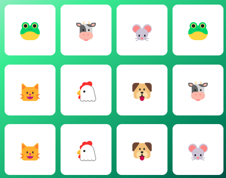

<h1>

Jogo da Memória
</h1>

    
Sumário

    <ol>
        <li><a href="#pushpin-sobre">Sobre</a></li>
        <li><a href="#hammer_and_wrench-funcionalidades">Funcionalidades</a></li>
        <li><a href="#computer-tecnologias-e-recursos-utilizados">Tecnologias e recursos utilizados</a></li>
            </ul>
        </li>
        <li><a href="#woman_technologist-desenvolvedora">Desenvolvedora</a></li>
    </ol>

## :pushpin: Sobre
O Projeto consiste em um jogo interativo de memória, no qual o Player se desafiara a lembrar dos cards formando pares. Segue abaixo tela do game: 

    

## :hammer_and_wrench: Funcionalidades
- [x] Clique nos cards para desvira-los
- [x] Combinação de pares de cards
- [x] Reset do jogo

## :computer: Tecnologias e recursos utilizados
- [VSCode](https://code.visualstudio.com/)
- [Git](https://git-scm.com/)

#### Fontes
- Monospace

## :woman_technologist: Desenvolvedora

 
<strong>Evely Tereza de Jesus Soares</strong>
 
Engenharia da Computação
 

